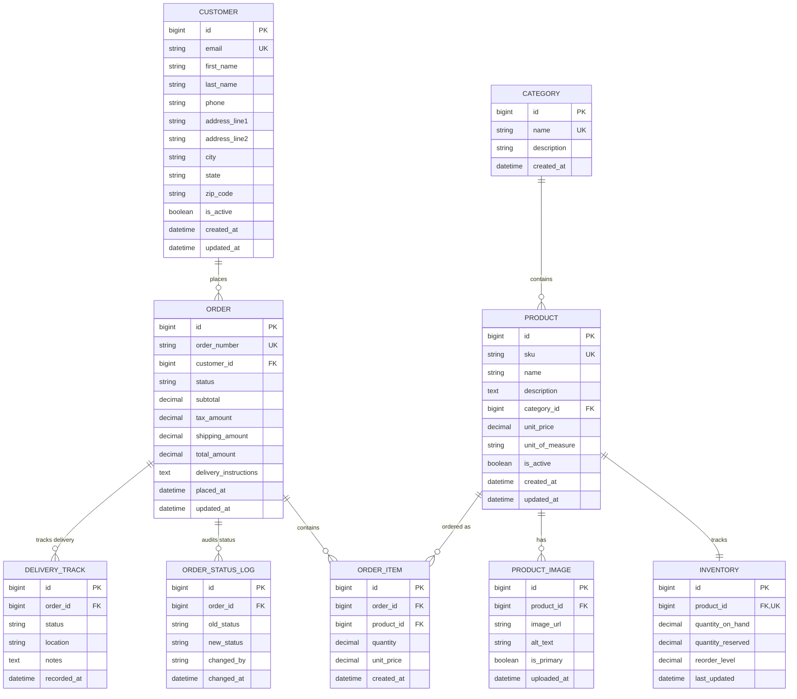

# Purdue Capstone — Azure E-Commerce Platform

**IT473 Cloud Infrastructure & Data Engineering**  
*Food Distribution E-Commerce Platform built with Django, Docker, PostgreSQL, and Microsoft Azure*

---

## Table of Contents

1. [Project Overview](#1-project-overview)
2. [Tech Stack](#2-tech-stack)
3. [Quick Start — Local Docker](#3-quick-start--local-docker)
4. [Database Schema](#4-database-schema)
5. [Cloud Architecture](#5-cloud-architecture)
6. [Azure Deployment Guide](#6-azure-deployment-guide)
7. [Environment Configuration](#7-environment-configuration)
8. [Project Structure](#8-project-structure)
9. [Available Endpoints](#9-available-endpoints)
10. [Troubleshooting](#10-troubleshooting)
11. [Team & Next Steps](#11-team--next-steps)

---

## 1. Project Overview

This is a full-stack e-commerce platform for a food distribution company, built as the capstone project for Purdue's IT473 course. The application supports product catalog management, customer ordering, inventory tracking, delivery logistics, and order status auditing.

| Attribute | Value |
|-----------|-------|
| **Framework** | Django 5.1 + Python 3.12 |
| **Local Database** | PostgreSQL 16 (Docker) |
| **Production Database** | Azure SQL Database (MSSQL) |
| **Compute** | Azure App Service (Web App for Containers) |
| **CI/CD** | GitHub Actions → Azure Container Registry → App Service |
| **Repository** | `https://github.com/esayeed/purdue_capstone` |

---

## 2. Tech Stack

| Layer | Technology | Purpose |
|-------|-----------|---------|
| **Frontend** | Django Templates + Bootstrap 5 | Server-rendered UI |
| **Backend** | Django 5.1 + Gunicorn | WSGI application server |
| **Local DB** | PostgreSQL 16 | Development database |
| **Production DB** | Azure SQL Database | Managed cloud SQL |
| **Container** | Docker + Docker Compose | Local dev environment |
| **Registry** | Azure Container Registry | Private image storage |
| **Hosting** | Azure App Service (Linux) | Managed container hosting |
| **CI/CD** | GitHub Actions | Automated build & deploy |
| **Secrets** | python-dotenv + Azure Key Vault | Environment configuration |

---

## 3. Quick Start — Local Docker

### Prerequisites

- [Docker](https://docs.docker.com/get-docker/) (Engine + Compose)
- [Git](https://git-scm.com/)
- Bash / PowerShell / Terminal

### Step 1: Clone & Enter

```bash
git clone https://github.com/esayeed/purdue_capstone.git
cd purdue_capstone
```

### Step 2: Create Environment File

```bash
cp .env.example .env
```

Edit `.env` and set real values:

```bash
# Django
DJANGO_SECRET_KEY=your-50-char-random-string-here
DJANGO_DEBUG=1
DJANGO_ALLOWED_HOSTS=localhost,127.0.0.1

# PostgreSQL (local Docker)
POSTGRES_DB=app_db
POSTGRES_USER=app_user
POSTGRES_PASSWORD=your-secure-local-password
POSTGRES_HOST=db
POSTGRES_PORT=5432
```

> **⚠️ NEVER commit `.env` to Git.** It is already in `.gitignore`.

### Step 3: Launch

```bash
docker compose up --build -d
```

This will:
1. Build the Django image (with Microsoft ODBC Driver 18 for Azure SQL)
2. Start PostgreSQL 16
3. Wait for the database to be healthy
4. Start the Django app and run migrations automatically

### Step 4: Verify

Wait ~15 seconds, then test:

```bash
# Health check
curl http://localhost:8000/health/
# Expected: ok

# Homepage
curl http://localhost:8000/
# Expected: HTML dashboard

# Database health
curl http://localhost:8000/health/db/
# Expected: {"status": "ok", "db": "connected", "engine": "postgresql"}
```

### Step 5: Seed Test Data

```bash
docker compose exec web python scripts/seed_db.py
```

This creates:
- 5 product categories
- 10 sample products with inventory
- 3 customers
- 2 sample orders with delivery tracking

### Step 6: Open in Browser

- **Dashboard:** http://localhost:8000/
- **Add Product:** http://localhost:8000/add-product/
- **Django Admin:** http://localhost:8000/admin/
- **Health Check:** http://localhost:8000/health/

### Useful Commands

```bash
# View logs
docker compose logs -f web

# Restart
docker compose restart

# Stop everything
docker compose down

# Wipe database and start fresh
docker compose down -v
docker compose up --build -d

# Run Django shell
docker compose exec web python manage.py shell

# Create superuser
docker compose exec web python manage.py createsuperuser
```

---

## 4. Database Schema

### 4.1 Entity Relationship Diagram



### 4.2 Key Relationships

| Relationship | Type | Business Rule |
|--------------|------|---------------|
| Customer → Order | One-to-Many | A customer can place many orders |
| Order → OrderItem | One-to-Many | Each order has 1+ line items |
| Product → Category | Many-to-One | Every product belongs to one category |
| Product → Inventory | One-to-One | One stock record per product |
| Order → DeliveryTrack | One-to-Many | Multiple tracking updates per order |
| Order → OrderStatusLog | One-to-Many | Full audit trail of status changes |

### 4.3 Indexes

- `main_customer(email)` — login lookups
- `main_customer(created_at)` — customer reporting
- `main_product(sku)` — inventory scans
- `main_product(name)` — search
- `main_product(category_id)` — category filtering
- `main_order(order_number)` — order lookups
- `main_order(customer_id)` — customer order history
- `main_order(status)` — status-based filtering
- `main_deliverytrack(order_id)` — delivery queries

---

## 5. Cloud Architecture

Open `docs/cloud-architecture.html` in any browser to view the interactive architecture diagram. It shows:

- **Azure App Service** — Django container hosting
- **Azure SQL Database** — Production data layer
- **Azure Container Registry** — Private Docker images
- **Azure Blob Storage** — Product images (Unit 5+)
- **Azure Key Vault** — Secret management (Unit 6+)
- **Azure Monitor** — Observability (Unit 7+)
- **GitHub Actions** — CI/CD pipeline
- **Local Docker Compose** — Development environment

### Architecture Highlights

```
┌──────────────────────────────────────────────────────────────────┐
│  Microsoft Azure — East US                                │
│                                                          │
│  ┌────────────────────┐  ┌────────────────────┐  ┌──────────┐ │
│  │ Azure App Service    │  │ Azure SQL Database    │  │  ACR     │ │
│  │  (Django Container)   │  │  (food-distributor-db)│  │ (Images) │ │
│  └────────────────────┘  └────────────────────┘  └──────────┘ │
│         ↑                                    ↑              ↑    │
│         │                                    │              │    │
│  ┌────────────────────────────────────────────────────┐         │    │
│  │  GitHub Actions CI/CD Pipeline               │─────────┬────┤    │
│  │  Build → Test → Push to ACR → Deploy        │         │    │
│  └────────────────────────────────────────────────────┘         │    │
│                                                          │    │
└──────────────────────────────────────────────────────────────────┘
          ↑
    ┌──────────────┐
    │  Users        │
    │  (Browser)    │
    └──────────────┘
```

---

## 6. Azure Deployment Guide

### Prerequisites

- Azure subscription (free tier works)
- [Azure CLI](https://docs.microsoft.com/en-us/cli/azure/install-azure-cli) installed
- Docker installed locally
- GitHub repo push access

### Step 1: Log In to Azure

```bash
az login
```

A browser opens. Sign in with your Azure account.

### Step 2: Create Resource Group

```bash
az group create \
  --name rg-purdue-capstone \
  --location eastus
```

> A Resource Group is a folder that holds all Azure services for this project.

### Step 3: Create Azure Container Registry (ACR)

```bash
az acr create \
  --resource-group rg-purdue-capstone \
  --name purduecapstoneacr \
  --sku Basic \
  --location eastus
```

### Step 4: Build & Push Docker Image

```bash
# Log in to ACR
az acr login --name purduecapstoneacr

# Build and tag
docker build -t purduecapstoneacr.azurecr.io/purdue-capstone:latest .

# Push to ACR
docker push purduecapstoneacr.azurecr.io/purdue-capstone:latest
```

### Step 5: Create App Service Plan

```bash
az appservice plan create \
  --resource-group rg-purdue-capstone \
  --name capstone-plan \
  --sku B1 \
  --is-linux
```

> **B1** = ~$13/month, dedicated CPU. For pure testing, use **F1** (free).

### Step 6: Create Web App (Container Mode)

```bash
az webapp create \
  --resource-group rg-purdue-capstone \
  --plan capstone-plan \
  --name purdue-food-distributor \
  --deployment-container-image-name purduecapstoneacr.azurecr.io/purdue-capstone:latest
```

> Replace `purdue-food-distributor` with a **globally unique** name.

### Step 7: Enable ACR Pull Permissions

```bash
az webapp identity assign \
  --resource-group rg-purdue-capstone \
  --name purdue-food-distributor

SP_ID=$(az webapp identity show \
  --resource-group rg-purdue-capstone \
  --name purdue-food-distributor \
  --query principalId \
  --output tsv)

az role assignment create \
  --assignee $SP_ID \
  --scope $(az acr show --name purduecapstoneacr --query id --output tsv) \
  --role "AcrPull"
```

### Step 8: Provision Azure SQL Database

```bash
# Create SQL Server
az sql server create \
  --resource-group rg-purdue-capstone \
  --name sql-capstone-2502c \
  --location eastus \
  --admin-user dbadmin \
  --admin-password '<STRONG_PASSWORD>'

# Create Database
az sql db create \
  --resource-group rg-purdue-capstone \
  --server sql-capstone-2502c \
  --name food-distributor-db \
  --service-objective S0

# Allow Azure services
az sql server firewall-rule create \
  --resource-group rg-purdue-capstone \
  --server sql-capstone-2502c \
  --name AllowAzureServices \
  --start-ip-address 0.0.0.0 \
  --end-ip-address 0.0.0.0
```

### Step 9: Configure App Service Settings

```bash
# Generate a secret key
python -c "import secrets; print(secrets.token_urlsafe(50))"

# Set environment variables
az webapp config appsettings set \
  --resource-group rg-purdue-capstone \
  --name purdue-food-distributor \
  --settings \
    "DJANGO_SECRET_KEY=<YOUR_SECRET_KEY>" \
    "DJANGO_DEBUG=0" \
    "DJANGO_ALLOWED_HOSTS=purdue-food-distributor.azurewebsites.net" \
    "DB_ENGINE=mssql" \
    "DB_NAME=food-distributor-db" \
    "DB_USER=dbadmin" \
    "DB_PASSWORD=<YOUR_DB_PASSWORD>" \
    "DB_HOST=sql-capstone-2502c.database.windows.net" \
    "DB_PORT=1433"
```

### Step 10: Restart & Verify

```bash
az webapp restart \
  --resource-group rg-purdue-capstone \
  --name purdue-food-distributor
```

Wait 2–3 minutes, then visit:

- `https://purdue-food-distributor.azurewebsites.net`
- `https://purdue-food-distributor.azurewebsites.net/health/`
- `https://purdue-food-distributor.azurewebsites.net/health/db/`

### Step 11: Run Migrations on Azure SQL

Via Azure Portal → App Service → SSH:

```bash
cd /app
python manage.py migrate
python manage.py createsuperuser
```

Or run a one-off container locally:

```bash
docker run --rm -it \
  -e DB_ENGINE=mssql \
  -e DB_HOST=sql-capstone-2502c.database.windows.net \
  -e DB_NAME=food-distributor-db \
  -e DB_USER=dbadmin \
  -e DB_PASSWORD='<PASSWORD>' \
  -e DJANGO_SECRET_KEY='<SECRET>' \
  purduecapstoneacr.azurecr.io/purdue-capstone:latest \
  python manage.py migrate
```

### Rollback (If Needed)

```bash
# Delete everything and start over
az group delete --name rg-purdue-capstone --yes --no-wait
```

---

## 7. Environment Configuration

### Files

| File | Purpose | Committed? |
|------|---------|------------|
| `.env.example` | Template with placeholder values | ✅ Yes |
| `.env` | Your real secrets (copy from example) | ❌ No (gitignored) |
| `.env.local` | Pre-filled local dev config | ❌ No (gitignored) |
| `.env.azure` | Pre-filled Azure config | ❌ No (gitignored) |
| `docker-compose.yml.example` | Clean compose template | ✅ Yes |
| `docker-compose.yml` | Your local overrides | ❌ No (gitignored) |

### Environment Variables

| Variable | Local Value | Azure Value | Description |
|----------|-------------|-------------|-------------|
| `DB_ENGINE` | `postgresql` | `mssql` | Database backend |
| `DJANGO_DEBUG` | `1` | `0` | Debug mode |
| `DJANGO_ALLOWED_HOSTS` | `localhost,127.0.0.1` | `.azurewebsites.net` | Host whitelist |
| `DJANGO_SECRET_KEY` | Any string | Long random string | Session/crypto key |
| `POSTGRES_*` | Your local creds | — | Local PostgreSQL |
| `DB_NAME` | — | `food-distributor-db` | Azure SQL DB name |
| `DB_USER` | — | `dbadmin` | Azure SQL login |
| `DB_PASSWORD` | — | Your SQL password | Azure SQL password |
| `DB_HOST` | — | `.database.windows.net` | Azure SQL server |
| `DB_PORT` | — | `1433` | SQL Server port |

---

## 8. Project Structure

```
purdue_capstone/
├── apps/
│   └── main/
│       ├── __init__.py
│       ├── apps.py
│       ├── forms.py          # Product & Inventory forms
│       ├── models.py         # All database models
│       ├── urls.py           # URL routing
│       ├── views.py          # Page logic
│       └── migrations/
│           ├── __init__.py
│           └── 0001_initial.py
├── config/                 # Django project config
│   ├── __init__.py
│   ├── asgi.py
│   ├── settings.py         # Dual DB config (env-driven)
│   ├── urls.py             # Root URL config
│   └── wsgi.py
├── docs/                   # Documentation
│   ├── cloud-architecture.html   # Interactive architecture diagram
│   ├── Database_Design.md
│   ├── Saturday_Test_Plan.md
│   ├── Complete_Deployment_Guide.md
│   └── ...
├── scripts/
│   ├── seed_db.py          # Populate test data
│   └── test_db_connection.py
├── templates/              # HTML templates
│   ├── base.html
│   └── main/
│       ├── home.html
│       └── add_product.html
├── .github/
│   └── workflows/
│       └── azure-deploy.yml  # GitHub Actions CI/CD
├── .env.example            # Environment template
├── .gitignore
├── docker-compose.yml      # Local orchestration
├── docker-compose.yml.example
├── Dockerfile
├── manage.py
├── requirements.txt
└── README.md               # This file
```

---

## 9. Available Endpoints

| Endpoint | Method | Description |
|----------|--------|-------------|
| `/` | GET | Dashboard homepage with stats |
| `/add-product/` | GET/POST | Create product + inventory |
| `/health/` | GET | Basic health check (`ok`) |
| `/health/db/` | GET | Database connectivity check (JSON) |
| `/admin/` | GET | Django admin panel |

---

## 10. Troubleshooting

### "DisallowedHost" Error

Your `DJANGO_ALLOWED_HOSTS` does not include the URL you're using. Update `.env`:

```bash
DJANGO_ALLOWED_HOSTS=localhost,127.0.0.1,192.168.50.193,68.51.28.186
```

Then restart: `docker compose restart`

### "password authentication failed for user app_user"

The PostgreSQL volume was created with a different password. Wipe and restart:

```bash
docker compose down -v
docker compose up --build -d
```

### Docker Can't Mount from Nextcloud/FUSE

If your project lives on a FUSE mount (e.g., Nextcloud, rclone), Docker cannot bind-mount it. Copy to the native filesystem:

```bash
rsync -av --exclude='.git' /path/to/nextcloud/purdue_capstone/ ~/purdue_capstone_run/
cd ~/purdue_capstone_run
docker compose up --build -d
```

### Web Container Keeps Restarting

Check logs:

```bash
docker compose logs web
```

Common causes:
- Database not ready → wait 10s and restart
- Wrong `POSTGRES_PASSWORD` in `.env` → wipe volume (see above)
- `DJANGO_ALLOWED_HOSTS` missing → add your IP

### Azure SQL Connection Fails

1. Verify firewall rule allows Azure services
2. Check `DB_HOST` ends with `.database.windows.net`
3. Ensure `DB_ENGINE=mssql` in App Service settings
4. Test from local: `python scripts/test_db_connection.py`

---

## 11. Team & Next Steps

### Team Roles

| Role | Owner | Responsibilities |
|------|-------|------------------|
| Azure Admin | Marc | Subscription, resource provisioning, billing |
| Lead Developer | Esam | Django backend, database models, deployment |
| Frontend/UI | Marriette | Templates, user experience, Bootstrap styling |
| DevOps/CI-CD | King Natie | GitHub Actions, monitoring, security |

### Roadmap by Unit

| Unit | Focus | Deliverables |
|------|-------|--------------|
| **Unit 3** | Project Planning | Charter, WBS, risk register, tech plan |
| **Unit 4** | Local Development | Docker testbed, models, migrations, seed data |
| **Unit 5** | Cloud Storage | Azure Blob Storage for product images |
| **Unit 6** | Security | Key Vault, Private Endpoints, TLS hardening |
| **Unit 7** | Monitoring | Azure Monitor, alerts, performance tuning |
| **Unit 8** | CI/CD | GitHub Actions, staging slots, automated deploys |

### Immediate Next Actions

- [ ] Saturday session: Deploy to Azure App Service + connect Azure SQL
- [ ] Seed Azure SQL with test data via `scripts/seed_db.py`
- [ ] Verify `/health/db/` returns connected status from Azure
- [ ] Commit `docs/cloud-architecture.html` and updated `README.md`

---

*Last updated: June 27, 2026*  
*For questions, open an issue on GitHub or check the `docs/` folder.*
